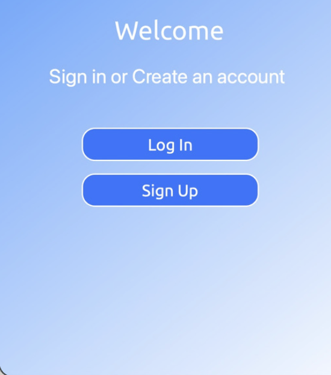
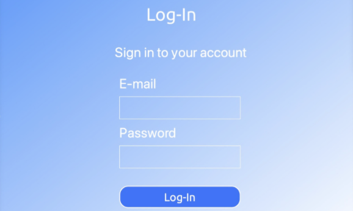
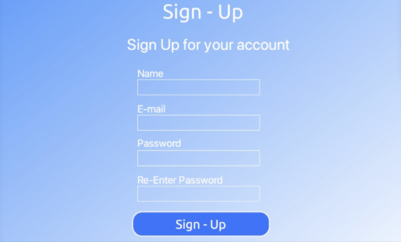
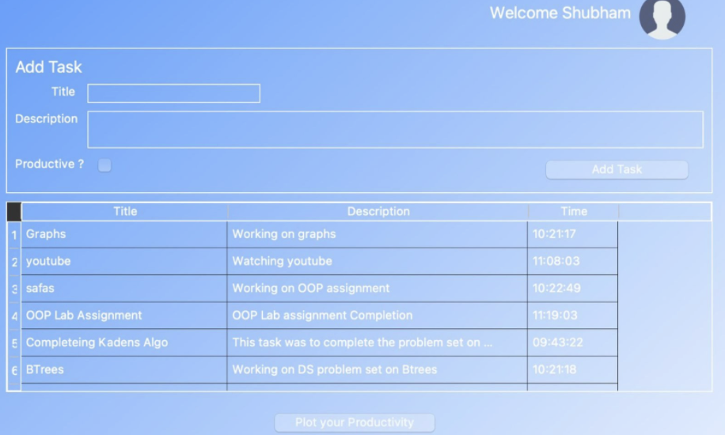

## Habit Tracker App

In the modern day competitive scenario all we need to do is increase our productivity. The distractions are our real enemy and we need to stay focused. 
Recent research  has indicatd that acountability while working boosts our productivity levels significantly.
####
With our solution one can take a new step towards productivity. We have utilized `PyQt Framework` for the UI and `Firebase Firestore` for databse and authentication.
This makes the whole application cross-platform form and, with cloud based authentication and database all the application instances can remain synced at any given point 
of time.
## Object Oriented Programming Concepts
- Classes and Objects
- Constructors - default and parameterised
- Inheritance, primarily used during the UI design using PyQt5
- Encapsulation, primarily used to keep the user's data private and safe
- Exception Handling
## How to Run
- Install `pyqt5` and `pyrebase` libraries using `pip`
- Run the file named `main.py`
## Contributors

<a href="https://github.com/remarkablemark">
  
  
Saujanya Sood

</a>

## Screens

### Welcome Screen
The welcome screen lets the user sign up into the app to create an account onto the app.

### Login
These two windows are created using PyQt5 and use Firebase Authentication features, which are accessed using the Auth class.

### Sign - Up Screen

### Dashboard
The dashboard has 2 sections - an Add Task section and a productivity tracker.
###
We also provide the user with the option to plot their productivity on a graph.

